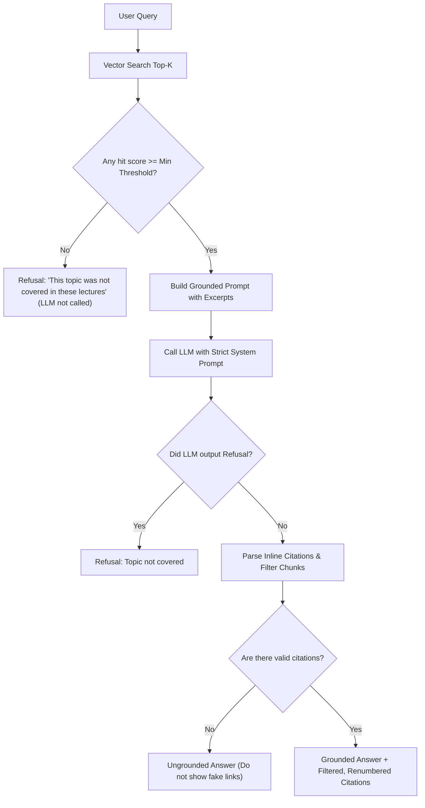

# Architectural Learnings & Blueprint from YT-Lecture RAG (`ytscraper`)

This document synthesizes deep architectural insights, non-obvious engineering decisions, failure modes, and best practices analyzed from [perryvegehan/padho_with_pratyush_Ai_Enginner (week3/ytscraper)](https://github.com/perryvegehan/padho_with_pratyush_Ai_Enginner/tree/main/week3/ytscraper).

---

## 1. Product Philosophy: The "Demo Moment"

> **"The differentiator is timestamp-level retrieval. Every generic RAG demo returns a blob of text. This returns a specific place in a video."**

1. **The -5 Second Lead-in Rule**:
   - Retrieval hits the chunk containing the exact answer, but the explanation almost always *starts* a few seconds before.
   - When generating playback URLs (`https://youtube.com/watch?v={id}&t={start_sec}s`), subtract **5 seconds** (clamped to 0). This gives the user immediate conversational context.
2. **In-Page Player Seeking (`player.seekTo`)**:
   - In the frontend web app, use the **YouTube IFrame Player API** (`player.seekTo(start_sec, true)`).
   - Clicking a citation citation should smoothly jump inside the embedded player on the page, rather than opening a distracting new tab.

---

## 2. Hallucination & False-Grounding Defense (The Critical Engineering Beat)

> **"The LLM knows the subject already. If it is handed junk context, it will happily answer from its own training and attach your timestamps to it — the user clicks the link and you are talking about something else entirely. That is strictly worse than saying 'This topic was not covered'."**

A RAG system that cannot say *"I don't know / Not covered"* is broken. We must enforce three distinct guardrails:



### The 3 Core Guardrails:
1. **Guard 1 (Pre-LLM Cutoff Guard)**:
   - If no retrieved chunk passes the similarity threshold (or distance cutoff), **immediately return the refusal without calling the LLM**.
   - *Why?* Eliminates API costs, removes latency, and mathematically guarantees zero hallucinations when questions are off-topic (e.g. asking about "React hooks" in a Python or DSA playlist).
2. **Guard 2 (Model Refusal Prompting)**:
   - System prompt instructs the model: *"Answer ONLY using the transcript excerpts below. If they do not cover it, output exactly: 'Ye topic in lectures me cover nahi hua' / 'This topic is not covered in these lectures'."*
3. **Guard 3 (Citation Filtering & Dynamic Renumbering)**:
   - The LLM cites inline using `[1]`, `[2]`.
   - If 5 chunks were provided in the prompt, but the LLM only referenced `[2]`, **only show citation [2]** (renumbered as `[1]` in the UI).
   - Never show 5 links at the bottom if only one was actually cited; it destroys user trust.

---

## 3. Transcript Ingestion & Caching Strategy

> **"Transcripts are the precious artifact (hours of GPU time or API calls). Everything downstream of them is cheap to rebuild."**

1. **Local Persistent Cache (`data/transcripts/<video_id>.json`)**:
   - Check the cache folder first. If `<video_id>.json` exists, load and return immediately.
   - Never re-fetch or re-transcribe existing videos.
2. **Atomic Writes**:
   - Write transcript JSON to a temporary file (`.tmp`) and then call `os.replace` to atomically move it into place.
   - Prevents corrupted, half-written transcript files if a user interrupts the run (Ctrl+C).
3. **Fast Playlist Listing**:
   - Use `yt-dlp` with `extract_flat: True` (or `"in_playlist"`).
   - This fetches metadata for 50+ playlist videos in a single network request without downloading video media or triggering rate limits.
4. **Idempotent Re-indexing**:
   - Because transcripts are cached locally, modifying chunk size, prompt templates, or embedding models takes only seconds to re-run, with zero re-downloading.

---

## 4. Chunking Logic: Domain Rules Over Generic Splitters

> **"Generic splitters (RecursiveCharacterTextSplitter) operate on a single concatenated string and throw away timestamps. The timestamp IS the product."**

1. **Greedy Time-Window Merge with Segment Alignment**:
   - Target window: **60 to 75 seconds** (roughly 150–220 words of speech, representing one coherent thought).
   - Overlap: **12 to 15 seconds**.
   - **Never split a subtitle segment in half**: always expand or rewind to the nearest whole segment boundary.
2. **Prefix Video Title to Chunk Text**:
   - Structure text as:
     ```python
     f"{video_title}\n\n{body}"
     ```
   - *Why this works*: A segment at minute 34 often explains an implementation detail without repeating what data structure or algorithm is being discussed. Prefixing the title acts as a semantic anchor.
3. **Repetition & Loop Hallucination Filter**:
   - Whisper and auto-caption models occasionally enter repetition loops on background music or silences (repeating phrases 10+ times).
   - Check if the most common sentence accounts for >60% of the chunk; if so, discard the chunk as retrieval poison.
4. **Minimum Word Filter**:
   - Discard chunks with fewer than 15 words (channel intros, music interludes, sponsor pauses, video outros).

---

## 5. Embeddings & Vector Storage (Qdrant Best Practices)

1. **Collection Naming with Dimensionality**:
   - Name collections including the model dimension, e.g., `yt_transcripts_384` (FastEmbed BGE-small) or `yt_transcripts_1024` (BGE-M3) or `yt_transcripts_768` (Gemini).
   - Prevents vector database crashes when experimenting with different embedding models.
2. **Deterministic UUIDs for Idempotent Upserts**:
   - Compute point IDs as `uuid.uuid5(uuid.NAMESPACE_DNS, f"{video_id}_{start_sec}")`.
   - Running the ingestion script multiple times updates existing points in-place rather than creating duplicates.
3. **Dual-Mode Vector DB (Server + Local Fallback)**:
   - Connect to Qdrant Docker/Cloud (`localhost:6333` or `QDRANT_URL`).
   - If the server is offline, fallback automatically to local disk storage (`./qdrant_storage`), ensuring development continues uninterrupted.

---

## 6. Evaluation Framework: Golden Set (`eval/golden.json`)

To know whether a change (chunk size, overlap, embedding model, or prompt) actually improved retrieval rather than just guessing:

1. **Create `eval/golden.json`**:
   - 15–20 hand-crafted test questions from the actual playlist.
   - Example entry:
     ```json
     {
       "question": "Where is memoization vs tabulation explained?",
       "expected_video_id": "MwZwr5Tvyxo",
       "expected_around_sec": 724,
       "tolerance_sec": 60
     }
     ```
2. **Hit Rate @ K Metric**:
   - A retrieval is considered a **HIT** if the expected `video_id` is in the top-K results **AND** the retrieved timestamp window overlaps with `expected_around_sec ± tolerance_sec`.
   - Produces a concrete, benchmarked percentage (e.g. `Hit Rate @ 5: 88.2%`).

---

## 7. Comparative Roadmap: What We Have vs. What's Next

| Feature | Reference Repo (`week3/ytscraper`) | Our Implementation (`yt-playlist-rag`) | Status |
|---|---|---|---|
| **Playlist Scraping** | `yt-dlp` flat extraction | `yt-dlp` flat extraction | ✅ Completed |
| **Caption Parsing** | Whisper on downloaded audio | Direct YouTube Captions (fast, free) | ✅ Completed |
| **Time-Window Chunking** | Time-based sliding window | Segment-aligned sliding window | ✅ Enhanced |
| **Title Prefixing** | `title + "\n\n" + body` | Added to chunker | 🔄 Upgrade next |
| **Repetition Filter** | Sentence counter filter | Basic whitespace filtering | 🔄 Add loop filter |
| **-5s Lead-in URL** | Offset start time by 5s | Direct start timestamp | 🔄 Add -5s offset |
| **Vector DB** | Qdrant Cloud | Qdrant Docker + Local Disk Fallback | ✅ Completed |
| **Embeddings** | BGE-M3 (PyTorch) / Gemini | FastEmbed (ONNX CPU, 384-dim) | ✅ Completed (fast, zero API cost) |
| **LLM Generation** | Groq / Gemini | Empty (`generator.py`) | 🚀 Build next |
| **Refusal & Grounding** | 3-tier refusal guardrails | To implement in `generator.py` | 🚀 Build next |
| **Web Frontend** | Plain HTML + YouTube IFrame | Next.js (`apps/web`) + IFrame API | 🚀 Build next |
| **Golden Eval** | `eval/golden.json` CLI | To add | 🎯 Optional Polish |
